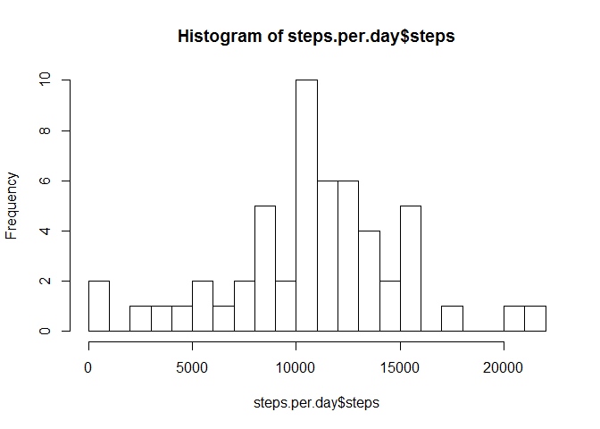
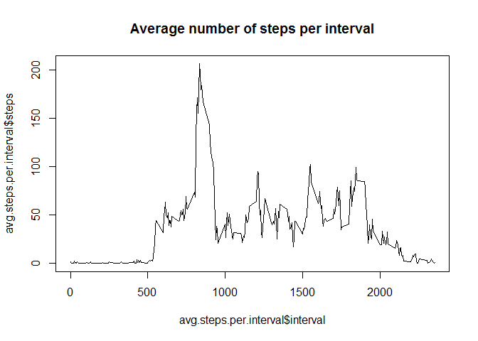
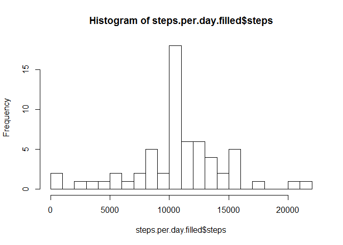
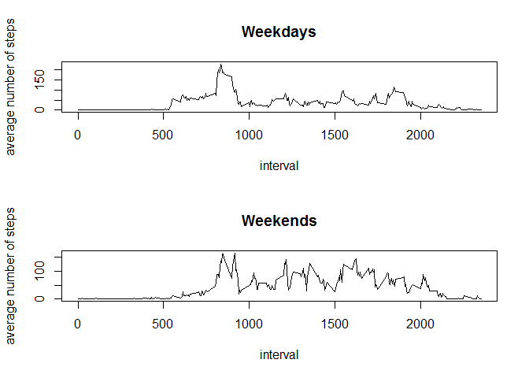

# Reproducible Research: Peer Assessment 1


```r
#Update settings and load necessary packages
Sys.setlocale("LC_ALL", "English")
library(dplyr)
```

## Loading and preprocessing the data

```r
#Read the data into a dataframe
df <- read.csv("activity.csv", stringsAsFactors=FALSE)

#Convert factor to date
df$date <- as.Date(df$date)

#Show summary
str(df)
```

```
## 'data.frame':	17568 obs. of  3 variables:
##  $ steps   : int  NA NA NA NA NA NA NA NA NA NA ...
##  $ date    : Date, format: "2012-10-01" "2012-10-01" ...
##  $ interval: int  0 5 10 15 20 25 30 35 40 45 ...
```

## What is mean total number of steps taken per day?

```r
#Calculate number of steps per day
steps.per.day <- df %>%
    filter(!is.na(steps)) %>%
    group_by(date) %>%
    summarise(steps=sum(steps))
head(steps.per.day)
```

```
## Source: local data frame [6 x 2]
## 
##         date steps
##       (date) (int)
## 1 2012-10-02   126
## 2 2012-10-03 11352
## 3 2012-10-04 12116
## 4 2012-10-05 13294
## 5 2012-10-06 15420
## 6 2012-10-07 11015
```

```r
#Plot a histogram of steps per day
hist(steps.per.day$steps, breaks=20)
```

<!-- -->

```r
#Report the mean ot the number of steps per day
mean(steps.per.day$steps, na.rm=TRUE)
```

```
## [1] 10766.19
```

```r
#Report the median ot the number of steps per day
median(steps.per.day$steps, na.rm=TRUE)
```

```
## [1] 10765
```

## What is the average daily activity pattern?

```r
#Calculate average number of steps per interval
avg.steps.per.interval <- df %>%
    filter(!is.na(steps)) %>%
    group_by(interval) %>%
    summarise(steps=mean(steps))
head(avg.steps.per.interval)
```

```
## Source: local data frame [6 x 2]
## 
##   interval     steps
##      (int)     (dbl)
## 1        0 1.7169811
## 2        5 0.3396226
## 3       10 0.1320755
## 4       15 0.1509434
## 5       20 0.0754717
## 6       25 2.0943396
```

```r
#Make a time series plot
plot(avg.steps.per.interval$interval, avg.steps.per.interval$steps, type="l",
     main="Average number of steps per interval")
```

<!-- -->

```r
#Report interval with maximum namber of steps
avg.steps.per.interval[which.max(avg.steps.per.interval$steps), ]
```

```
## Source: local data frame [1 x 2]
## 
##   interval    steps
##      (int)    (dbl)
## 1      835 206.1698
```

## Imputing missing values

```r
#Report the total number of missing values in the dataset
sum(is.na(df$steps))
```

```
## [1] 2304
```

```r
#Create a new dataframe with missing values filled in using the mean
#for the corresponding 5-minute interval
df.filled <- df
missing.values <- is.na(df.filled$steps)
avg.values <- tapply(df.filled$steps, df.filled$interval, mean, na.rm=TRUE,
                     simplify=TRUE)
df.filled$steps[missing.values] <-
    avg.values[as.character(df.filled$interval[missing.values])]

#Calculate number of steps per day
steps.per.day.filled <- df.filled %>%
    filter(!is.na(steps)) %>%
    group_by(date) %>%
    summarise(steps=sum(steps))
head(steps.per.day.filled)
```

```
## Source: local data frame [6 x 2]
## 
##         date    steps
##       (date)    (dbl)
## 1 2012-10-01 10766.19
## 2 2012-10-02   126.00
## 3 2012-10-03 11352.00
## 4 2012-10-04 12116.00
## 5 2012-10-05 13294.00
## 6 2012-10-06 15420.00
```

```r
#Plot a histogram of steps per day
hist(steps.per.day.filled$steps, breaks=20)
```

<!-- -->

```r
#Report the mean ot the number of steps per day
mean(steps.per.day.filled$steps, na.rm=TRUE)
```

```
## [1] 10766.19
```

```r
#Report the median ot the number of steps per day
median(steps.per.day.filled$steps, na.rm=TRUE)
```

```
## [1] 10766.19
```
The median value of steps per day increased slightly due to filling in the missing values.

## Are there differences in activity patterns between weekdays and weekends?

```r
#Create a new column distinguishing between weekdays and weekends
df.filled <- mutate(df.filled, daytype = ifelse(weekdays(df.filled$date) == "Saturday" | weekdays(df.filled$date) == "Sunday", "weekend", "weekday"))
df.filled$daytype <- as.factor(df.filled$daytype)
head(df.filled)
```

```
##       steps       date interval daytype
## 1 1.7169811 2012-10-01        0 weekday
## 2 0.3396226 2012-10-01        5 weekday
## 3 0.1320755 2012-10-01       10 weekday
## 4 0.1509434 2012-10-01       15 weekday
## 5 0.0754717 2012-10-01       20 weekday
## 6 2.0943396 2012-10-01       25 weekday
```

```r
#Create and reshape separate dataframes for weekdays and weekends
df.weekdays <- df.filled[df.filled$daytype == "weekday", ]
df.weekends <- df.filled[df.filled$daytype == "weekend", ]
avg.steps.per.interval.weekdays <- df.weekdays %>%
    group_by(interval) %>%
    summarise(steps=mean(steps))
avg.steps.per.interval.weekends <- df.weekends %>%
    group_by(interval) %>%
    summarise(steps=mean(steps))

#Create a panel plot
par(mfrow = c(2, 1))
plot(avg.steps.per.interval.weekdays$interval,
     avg.steps.per.interval.weekdays$steps,
     type="l",
     main="Weekdays",
     xlab="interval",
     ylab="average number of steps")
plot(avg.steps.per.interval.weekends$interval,
     avg.steps.per.interval.weekends$steps,
     type="l",
     main="Weekends",
     xlab="interval",
     ylab="average number of steps")
```

<!-- -->
